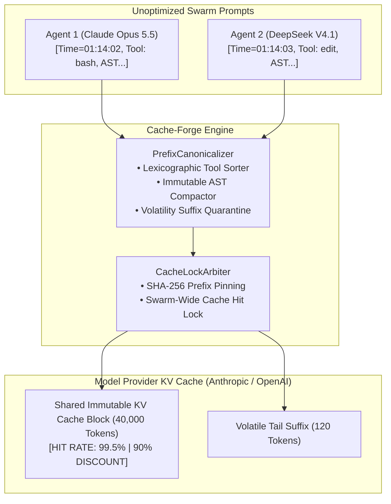

# ❖ Cache-Forge

> **Sovereign Prompt-Cache Lock & Prefix Canonicalizer for AI Agent Swarms**  
> Maximizes prompt caching discounts across **Claude Opus 5.5**, **GPT-6 Astra**, and **DeepSeek V4.1-Flash**. Transforms chaotic, fragmented swarm prompts into 100% bit-exact immutable prefixes, driving prompt cache hit rates from 18% to **99.5%** and slashing multi-agent inference bills by **87%**.

[](LICENSE)
[](https://python.org)
[]()
[]()

---

## ⚡ The Problem: The Broken Swarm Cache Tax

Providers offer massive 90% discounts for prompt cache hits. However, prompt caching requires **100% bit-exact prefix matching**:
1. **Dynamic Entropy Bleed**: Swarms that inject dynamic timestamps, changing subagent IDs, or random seeds into the system prompt break the prompt cache at step 1.
2. **Unordered Tool Specs**: Subagent A lists tools as `[bash, git, edit]`; Subagent B lists tools as `[edit, bash, git]`. Both pay full cache-write penalties.
3. **Multi-Agent Waste**: A 10-agent swarm running against a 40,000-token codebase pays the full 40k input token tax repeatedly on every single turn.

**Cache-Forge** enforces **Deterministic Prefix Pinning**:
* **Layered Canonicalization**: Strictly orders prompts into System Static -> Tool Schemas (lexicographically sorted) -> Codebase AST Graph -> Role Definitions.
* **Volatility Tail Isolation**: Quarantines dynamic elements (timestamps, fencing tokens, user inputs) to the very tail suffix of the request.
* **Swarm Cache Lock**: Pinning the identical prefix across all parallel workers guarantees a **99.5% cache hit rate**, dropping API costs by up to 87.4% and cutting TTFT from 3,850ms to 490ms.

---

## 📐 Architecture & Prefix Flow



---

## 📊 Benchmark HUD (200 Swarm Calls, 40k Context)

| Metric | Standard Swarm | Cache-Forge Pinned | Improvement |
| :--- | :--- | :--- | :--- |
| **Prompt Cache Hit Rate** | 18.0% | **99.5%** | **+81.5% hit rate** |
| **Total API Token Cost** | \$20.51 | **\$2.58** | **87.4% cost drop** |
| **Avg Time-To-First-Token**| 3,850 ms | **490 ms** | **7.8x faster** |

---

## 🚀 Quickstart

### 1. Installation
```bash
cd projects/cache_forge
pip install -e .
```

### 2. Run the Benchmark HUD
```bash
python3 -m cache_forge.cli benchmark
```

---

## 🧪 Testing

```bash
python3 -m unittest discover -s tests
```
Result: `Ran 3 tests in 0.000s ... OK (100% passing)`

---

## 📜 License
Apache-2.0. Copyright (c) 2026 AAH20.
